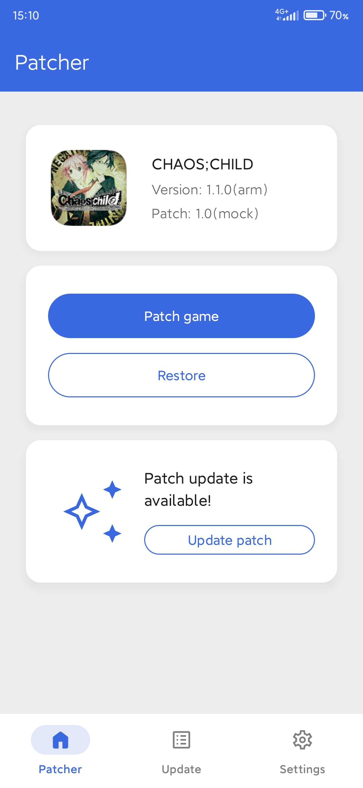
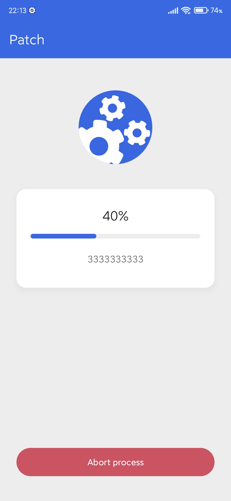
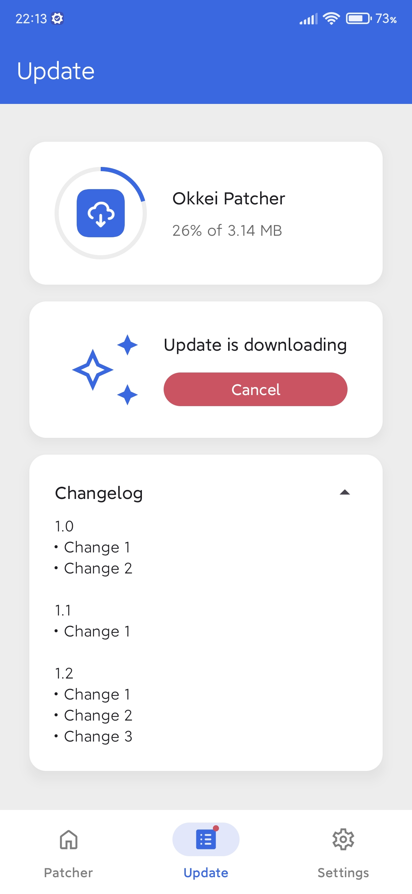
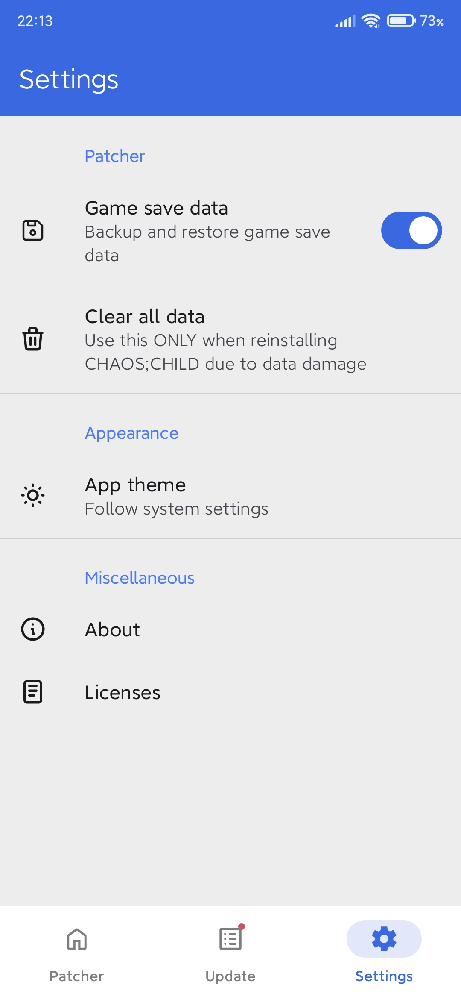
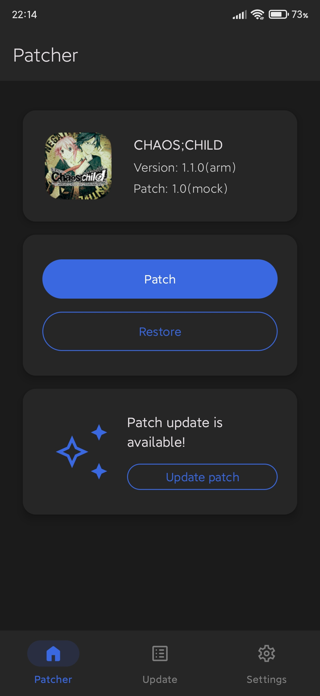
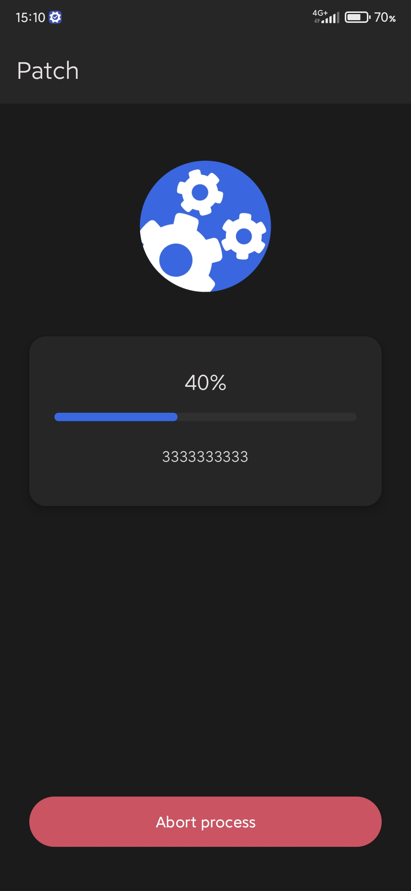
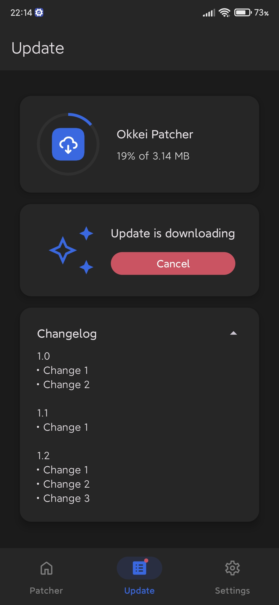
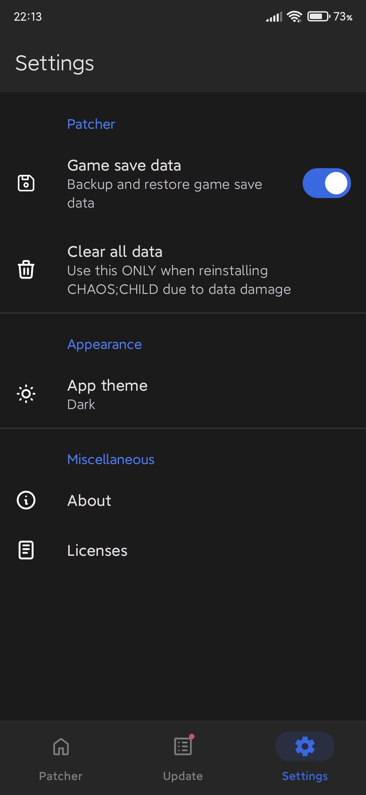

Okkei Patcher
==================


[](https://github.com/solrudev/OkkeiPatcher/releases)
[](/LICENSE)


**Okkei Patcher** is a companion app for localizing the Android version of CHAOS;CHILD visual novel.
It downloads the latest revision of CHAOS;CHILD Android localization patch and automatically applies
it to the installed game while creating a backup of its original installation, so that you can
easily go back to the unpatched Japanese version.

**Minimum supported Android version:** Android 4.4 KitKat.

# Download
Go to the [Releases](https://github.com/solrudev/OkkeiPatcher/releases) page to download the latest
APK.

**ATTENTION:** versions below 2.0.9 are now defunct due to domain name used for backend API has been
shut down.

# Screenshots
### Light theme
<div style="display: flex; width: 100%">
  
  
  
  
</div>

### Dark theme
<div style="display: flex; width: 100%">
  
  
  
  
</div>

# Architecture
**Okkei Patcher** follows Clean Architecture principles and best practices of modern Android app
development, such as edge-to-edge UI, adapting to different screen sizes, MVI pattern for
presentation layer logic, Repository pattern and single-activity approach, while also adhering to
[Material 3 design guidelines](https://m3.material.io/) (not wholeheartedly, though).

UI is built with Android View system (no Jetpack Compose, sorry, we have to support KitKat anyway).

Core logic of the app is highly abstracted and lives in the `domain` layer. It contains interfaces
such as `Operation`, `Game`, `GameFile`, `PatchUpdates`. Interacting with other layers is achieved
via dependency inversion.

Reliable task execution and status tracking is ensured by using
[Jetpack WorkManager](https://developer.android.com/topic/libraries/architecture/workmanager).

## Tech stack
- [Kotlin Coroutines](https://github.com/Kotlin/kotlinx.coroutines) &
  [Flow](https://kotlin.github.io/kotlinx.coroutines/kotlinx-coroutines-core/kotlinx.coroutines.flow/)
  for handling asynchronous cancellable tasks and reactive streams
- Android Jetpack
    - [DataStore](https://developer.android.com/topic/libraries/architecture/datastore) and
      [Room](https://developer.android.com/training/data-storage/room) for data persistence
    - [Dagger Hilt](https://dagger.dev/hilt/) for dependency injection
    - [WorkManager](https://developer.android.com/topic/libraries/architecture/workmanager) for
      reliable task execution
    - [Navigation](https://developer.android.com/guide/navigation) for implementing navigation with
      single-activity UI architecture
    - [Android Architecture Components](https://developer.android.com/topic/libraries/architecture/viewmodel)
      for handling components lifecycle and managing UI state holder
- [Ackpine](https://github.com/solrudev/Ackpine) for handling APK install sessions
  with Kotlin Coroutines
- [JetMVI](https://github.com/solrudev/JetMVI) for implementing UI state management
- [Okio](https://square.github.io/okio/) for I/O operations and file system abstraction
- [Zip4j](https://github.com/srikanth-lingala/zip4j) for working with ZIP archives
- [apksig](https://android.googlesource.com/platform/tools/apksig/+/master) for signing APK files
- [PseudoApkSigner](https://github.com/solrudev/PseudoApkSigner) for signing APK files on API < 24
- [Retrofit & OkHttp](https://square.github.io/retrofit/) for working with network requests
- [Moshi](https://github.com/square/moshi/) for deserializing JSON data
- [Material Components](https://github.com/material-components/material-components-android) for
  Material Design 3 UI components implementation
- [Lottie](https://airbnb.io/lottie/) for vector animations
- [Insetter](https://github.com/chrisbanes/insetter) for easy window insets handling
- [ProgressButton](https://github.com/razir/ProgressButton) for displaying progress indicator over a
  button
- [ViewBindingPropertyDelegate](https://github.com/androidbroadcast/ViewBindingPropertyDelegate) for
  simple access to view binding

# Building
**Okkei Patcher** requires Android Studio Koala and higher to build (Android Gradle Plugin 8.5+).

**Okkei Patcher** has two flavors: **prod** and **mock**.

**Prod** flavor is release version of the app. **Mock** flavor is a version with mocked
implementation of patch, restore and update functions and it doesn't require network or CHAOS;CHILD
to be installed. It's used to test the overall flow logic of the app and UI layouts.

By default release builds are signed with debug keystore. To use your own Android keystore in
release build, create `keystore.properties` file in root folder of the project with the following
contents:
```properties
storePassword=YOUR_KEYSTORE_PASSWORD
keyPassword=YOUR_KEY_PASSWORD
keyAlias=YOUR_KEY_ALIAS
storeFile=PATH_TO_YOUR_KEYSTORE_FILE
```

# License
**Okkei Patcher** is licensed under [GNU GPLv3 license](/LICENSE).